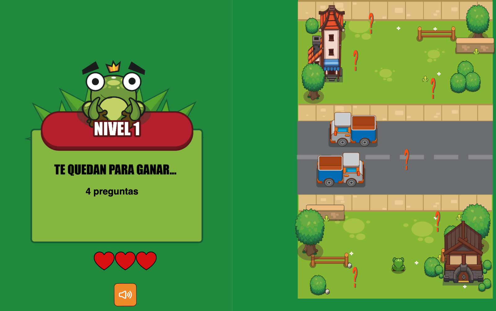
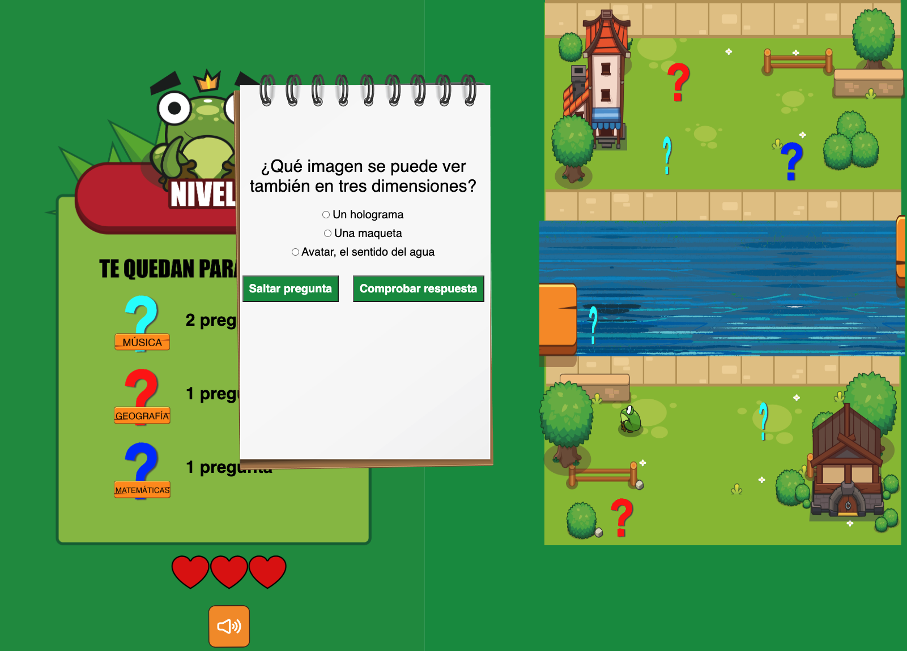

# Froggie Quizz

[play the game]: https://github.com/videogame-ironhack/frog_quizz/tree/ramapepe

## How it looks





## Description

Froggie has to go around the board and reach the quizz-objects without losing all its 3 lives.
Each object will pose a question that the player must answer correctly. If the player misses an answer or hits an obstacle, Froggie loses a life. In addition, in case the player does not know the answer to the question, he can skip it, but BEWARE! if you skip more than X questions the player will also lose.

## Intructions

Use `arrow keys` to move through board
Use `radio selectors` to answer the quizz
Press `enter` to restart the game

## MVP (DOM - CANVAS)

Player must reach the quizz-objects without dying and answer their respective questions correctly to win

## Backlog

- Create board with their respective objects and obstacles
- Give Froggie mobility
- Create collisions with quizz-objects and with obstacles
- Create the quizz-box: questions and 3 options to answer + sumbit and "skip question" button
- Life counter associated with collisions and quiz answers
- Prevent Frogie from going over houses and trees
- Generate the home screens, legend and game over

## Data structure

### index.js

```
window.onload = () => {

    //sets first aspect

document.querySelector("#lifes").style.visibility = "hidden";
document.querySelector("#quizz-legend-questionmark").style.visibility =
"hidden";

    //sets volume button

document.querySelector("#sound-button").onclick = () => {
let soundbutton = document.querySelector("#sound-button");
if (Game.playing === true) {
Game.playing = false;
soundbutton.src = "images/mutebutton.png";
Game.mute();
} else if (Game.playing === false) {
Game.playing = true;
soundbutton.src = "images/soundbutton.png";
Game.sound();
}
};

    //calls game initialization
    document.getElementById("start-button").onclick = () => {
    Game.init();}}

```

### game.js

```
const Game = {
//AUDIO
crashAudio: new Audio("./sounds/crash.mp3"),
jumpAudio: new Audio("./sounds/jump.mp3"),
backSound: new Audio("./sounds/backsound.mp3"),
gameOverSound: new Audio("./sounds/gameover.mp3"),
croacSound: new Audio("./sounds/croac.mp3"),
splashSound: new Audio("./sounds/splash.mp3"),
clin: new Audio("./sounds/clin.mp3"),

//DRAWING PROPERTIES
canvas: undefined,
ctx: undefined,
width: undefined,
height: undefined,
FPS: 60,

currentLevel: 1,

framesCounter: 0,

background1: undefined,
background2: undefined,
river: undefined,
player: undefined,

obstacleUp: undefined,
obstacleDown: undefined,
tableUp: undefined,
tableDown: undefined,

obstaclesDownArray: [],
obstaclesUpArray: [],
tablesUp: [],
tablesDown: [],
quizzObjects: [],
mathQuizzObjects: [],
geoQuizzObjects: [],
musicQuizzObjects: [],
explosionsArray: [],
splashdownsArray: [],

lifes: 3,
croacTimer: 0,
quizzScore: 2,
tileSize: 37,
playing: true,
atQuizz: false,
notEnoughQuizz: false,
typeOfQuestion: undefined,

keys: {
ENTER: 13,
},

//GAME FUNCTIONALITY
init() {
this.setContext();
this.setDimensions();
this.start();
this.generateQuizzObjects();
this.generateMathQuizzObjects();
this.generateMusicQuizzObjects();
this.generateGeoQuizzObjects();
this.generateObstaclesUp();
this.generateObstaclesDown();
},

setContext() {
this.canvas = document.querySelector("#canvas");
this.ctx = this.canvas.getContext("2d");
},

setDimensions() {
//assigns the height and width and applies it to the canvas
},

start() {
//starts counter, prints left side board with legend info, and calls all checking, drawing and cleaning functions that will be working full time
},

printLifes() {
//makes lifes counter dinamic
},

mute() {
//silences all audios
},

sound() {
//returns volume to all audios
},

displayCard() {
//shows quizz card
},

//RESET
reset() {
//call all classes and give them their constructor properties
},

//DRAW GRAPHICS
drawAll() {
//background
this.background.draw();
this.river.draw();
//map matrix
this.tileMap.draw();
//obstacles and platforms
this.obstaclesUpArray.forEach((obs) => {
obs.draw();
});
this.obstaclesDownArray.forEach((obs) => {
obs.draw();
});
this.tablesUp.forEach((tab) => {
tab.draw();
});
this.tablesDown.forEach((tab) => {
tab.draw();
});
//effects
this.explosionsArray.forEach((exp) => {
exp.draw();
});
this.splashdownsArray.forEach((splash) => {
splash.draw();
});}
//player
this.player.draw();
this.player.movement();
/quizz
this.quizzObjects.forEach((quiz) => {
quiz.draw();
});

//CLEAN EVERYTHING
clear() {
this.ctx.clearRect(0, 0, this.width, this.height);
},

//PRINT ARRAYS
generateQuizzObjects() {
this.quizzObjects.push(new QuizzObject());
this.quizzObjects.push(new QuizzObject());
this.quizzObjects.push(new QuizzObject());
},

generateMathQuizzObjects() {
this.mathQuizzObjects.push(new BlueQuizzObject());
this.mathQuizzObjects.push(new BlueQuizzObject());
},

generateGeoQuizzObjects() {
this.geoQuizzObjects.push(new WhiteQuizzObject());
this.geoQuizzObjects.push(new WhiteQuizzObject());
},

generateMusicQuizzObjects() {
this.musicQuizzObjects.push(new SkyQuizzObject());
this.musicQuizzObjects.push(new SkyQuizzObject());
},

generateTablesDown() {},
generateTablesUp() {},

generateObstaclesDown() {},
generateObstaclesUp() {},

generateExplosion() {},
generateSplashdown() {},

//CLEAN ARRAYS
clearObstaclesDown() {
//filters and clean Obstacles out of canvas
},

clearObstaclesUp() {},

clearTablesDown() {},

clearTablesUp() {},

clearQuizzObject() {},

//CHECKING FUNCTIONS
isCollisionUp() {
//checks if player is colliding with an upper obstacle
},

isCollisionDown() {},

quizzCollision() {
//checks if player is colliding with a quizz mark
},

mathQuizzCollision() {},

geoQuizzCollision() {},

musicQuizzCollision() {},

onTableUp() {
//at level 2, checks if player is over an upper table at the river
},

onTableDown() {},

//SPECIAL SCREENS
gameOver() {
//prints a different game over screen if you died because of no life or too much skipping questions
},

winScreen() {
//prints a winning screen
},

```

### player.js

```
class Player {
constructor(ctx, gameW, gameH, keys, tileMap) {
this.ctx = ctx;

    this.gameWidth = gameW;
    this.gameHeight = gameH;

    this.image = new Image();
    this.image.src = "./images/Sprite/quietaup_20.png";

    this.width = 148;
    this.height = 148;
    this.image.frames = 20;
    this.image.framesIndex = 0;
    this.lastMove = undefined;
    this.rightTile = 0;
    this.leftTile = 0;
    this.upTile = 0;
    this.downTile = 0;
    this.actualTile = undefined;
    this.requestedMovingDirection = null;

        //matrix for moving player
    this.map = [
      [0, 0, 0, 0, 0, 0, 0, 0, 0, 0, 0, 0, 0, 0, 0, 0, 0, 0],
      [0, 0, 1, 1, 0, 0, 0, 0, 0, 0, 0, 1, 1, 1, 0, 1, 1, 0],
      [0, 0, 1, 1, 0, 0, 0, 0, 0, 0, 0, 1, 1, 1, 0, 1, 1, 0],
      [0, 0, 1, 1, 0, 0, 0, 0, 0, 0, 0, 0, 0, 0, 1, 1, 1, 0],
      [0, 0, 1, 1, 0, 0, 0, 0, 0, 0, 0, 0, 0, 0, 1, 1, 1, 0],
      [0, 0, 1, 1, 0, 0, 0, 0, 0, 0, 0, 0, 0, 0, 1, 0, 0, 0],
      [0, 1, 1, 1, 0, 0, 0, 0, 0, 0, 0, 0, 0, 0, 1, 1, 0, 0],
      [0, 1, 0, 0, 0, 0, 0, 0, 0, 0, 0, 0, 0, 0, 1, 1, 0, 0],
      [0, 1, 0, 0, 0, 0, 0, 0, 0, 0, 0, 0, 0, 0, 0, 0, 0, 0],
      [0, 0, 0, 0, 0, 0, 0, 0, 0, 0, 0, 0, 0, 0, 0, 0, 0, 0],
      [0, 0, 0, 0, 0, 0, 0, 0, 0, 0, 0, 0, 0, 0, 0, 0, 0, 0],
      [0, 0, 0, 0, 0, 0, 0, 0, 0, 0, 0, 0, 0, 0, 0, 0, 0, 0],
      [0, 0, 0, 0, 0, 0, 0, 0, 0, 0, 0, 0, 0, 0, 0, 0, 0, 0],
      [0, 0, 0, 0, 0, 0, 0, 0, 0, 0, 0, 0, 0, 0, 0, 0, 0, 0],
      [0, 0, 0, 0, 0, 0, 0, 0, 0, 0, 0, 0, 0, 0, 0, 0, 0, 0],
      [0, 0, 0, 0, 0, 0, 0, 0, 0, 0, 0, 0, 0, 0, 0, 0, 0, 0],
      [0, 0, 0, 0, 0, 0, 0, 0, 0, 0, 0, 0, 0, 0, 0, 0, 0, 0],
      [0, 0, 0, 0, 0, 0, 0, 0, 0, 0, 0, 0, 0, 0, 1, 1, 1, 1],
      [1, 1, 1, 1, 0, 0, 0, 0, 0, 0, 0, 0, 0, 0, 1, 1, 1, 1],
      [1, 1, 0, 0, 0, 0, 0, 0, 0, 0, 0, 0, 0, 0, 1, 1, 1, 1],
      [1, 1, 0, 0, 0, 0, 0, 0, 0, 0, 0, 0, 0, 1, 1, 1, 1, 1],
      [1, 1, 1, 1, 1, 0, 0, 0, 0, 0, 0, 0, 0, 1, 1, 1, 1, 1],
      [1, 1, 1, 1, 1, 0, 0, 0, 0, 0, 0, 0, 1, 1, 1, 1, 1, 1],
      [0, 0, 1, 0, 0, 0, 0, 0, 0, 0, 0, 0, 1, 1, 1, 1, 1, 1],
      [0, 0, 1, 0, 0, 0, 0, 0, 0, 0, 0, 0, 1, 1, 1, 1, 1, 1],
      [0, 0, 0, 0, 0, 0, 0, 0, 0, 0, 0, 0, 0, 0, 0, 0, 0, 0],
    ];

    this.tileMap = tileMap;
    this.tileSize = 37;
    this.column = 0;
    this.row = 0;
    this.nextColumn = 0;
    this.nextRow = 0;

        //init position
    this.posX = 259;
    this.posY = 777;

        //moving velocity
    this.velMOVE = 3;

    this.keys = keys;
    this.keyPressed = [];

    this.setEventHandlers();

}

draw(framesCounter) {
//draws an animated player
}

movement() {
//checks if player can move and do it
}

setEventHandlers() {
//prints keyPressed array when keydown
}

document.addEventListener("keyup", (event) => {
//cleans keyPressed array when keyup
});
}

}

didCollideWithEnviroment(x, y) {
//checks the content of neighboring cells in the array
}

animate(framesCounter) {
//animates player using sprite images
}

```

### background.js

```
class BackgroundOne {
  constructor(ctx, w, h) {
    //sets background size, position, image...
  }

  draw() {
    //draws background
  }
```

### map.js

```
class TileMap {
  constructor(ctx, tileSize, player) {
    //creates info matrix for player moving at map
  }

  draw(ctx) {
    //draws cells at canvas and designe map
  }
```

### explosion.js

```
class Explosion {
  constructor(ctx) {
    //sets position and dimension for an animation if frog crash with a car
  }

  draw(framesCounter) {
    //draw explosion animation
  }

  animate(framesCounter) {
    //animates explosion
  }
}
```

### obstacles.js

```

class Obstacle {
constructor(ctx) {
// creates obstacle general class
}

draw(framesCounter) {
// draws obstacles
}

animate(framesCounter) {
// animates obstacles
}
}

class ObstacleUp extends Obstacle {
constructor(ctx) {
//creates extended obstacle 1

}
move() {
//moves obstacle 1
}
}


class ObstacleDown extends Obstacle {
constructor(ctx) {
super(ctx);
//creates extended obstacle 2
}

move() {
//moves obstacle 2
}
}

```

### quizz-data.js

```
let infoArray = []
//an array of arrays with questions. Every question array has an structure of [question, answer1, answer2, answer3, correct answer]

    //example
    [
    "mathsCuántos elementos forman la tabla periódica?",
    "118",
    "210",
    "94",
    "118",

],

    //DOM manipulation for giving quizz cards questions and answers info

let randomIndex = undefined;
let questionInfo = undefined;
let answer1Info = undefined;
let answer2Info = undefined;
let answer3Info = undefined;
let correctAnswer = undefined;
let answer1 = undefined;
let answer2 = undefined;
let answer3 = undefined;
const quizzBox = document.querySelector("#quizz-box");
const skipButton = document.querySelector("#skip-button");
const submitButton = document.querySelector("#submit-button");
const continueButton = document.querySelector("#continue-button");
const correctMessage = document.querySelector("#correct-answer-message");
const wrongMessage = document.querySelector("#wrong-answer-message");

function printQuizz() {
//puts a random question from array with its answers
}

function skipQuestion(event) {
//close actual question, delete it from array
}

function continueGame() {
//close quizz windows
}

window.addEventListener("load", () => {
//sets buttons actions for quizz
});

function printScore() {
//refresh quizz counter
}

function getResult(event) {
//checks if selected answer is correct or not and changes lifes or quizz counter
}
```

### quizz-objects.js

```
class QuizzObject {
//gives quizz marks of the map position, width, height and image}

  draw(framesCounter) {
    //draws question mark
  }

  animate(framesCounter) {
    //animates question mark
  }
}

class BlueQuizzObject extends QuizzObject {
    //quizz mark for level 2 that heridates info from QuizzObject but changes aspect. It's aspect gives player info about question type.
}
```

### table.js

```
class Table {
  constructor(ctx) {
    //gives level 2 platforms properties, position and image
  }

  draw() {
    //draws table
  }

  move() {
    //moves table
   }
}
```

### river.js

```
class River {
  constructor(ctx, w) {
   //creates river images
  }

  draw() {
    //draws river
  }

  move() {
    // gives movement to the river
  }
}

```

### splashdown.js

```

class Splashdown {
    //gives position and size info for animation if frog falls to the river
}

  draw(framesCounter) {
    //draw splashdown
  }

  animate(framesCounter) {
    //animates splashdown
  }

```

## States

- Start Game Screen
- Game Screen: Game legend (left) & Game Canvas (right)
- Game over Screen: Player loses all lives or Player skipped to many questions
- You Win Screen

## Links

[Play the game](https://videogame-ironhack.github.io/frog_quizz/)

[GitHub code](https://github.com/videogame-ironhack/frog_quizz)

[Canvas presentation](https://www.canva.com/design/DAFeUbuwXJ8/ETL1fPsrEoLNWY2TF8ZSzg/view?utm_content=DAFeUbuwXJ8&utm_campaign=designshare&utm_medium=link&utm_source=publishsharelink)

[Trello](https://trello.com/b/3p8UdlZQ/froggie-quizz)
